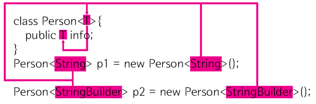
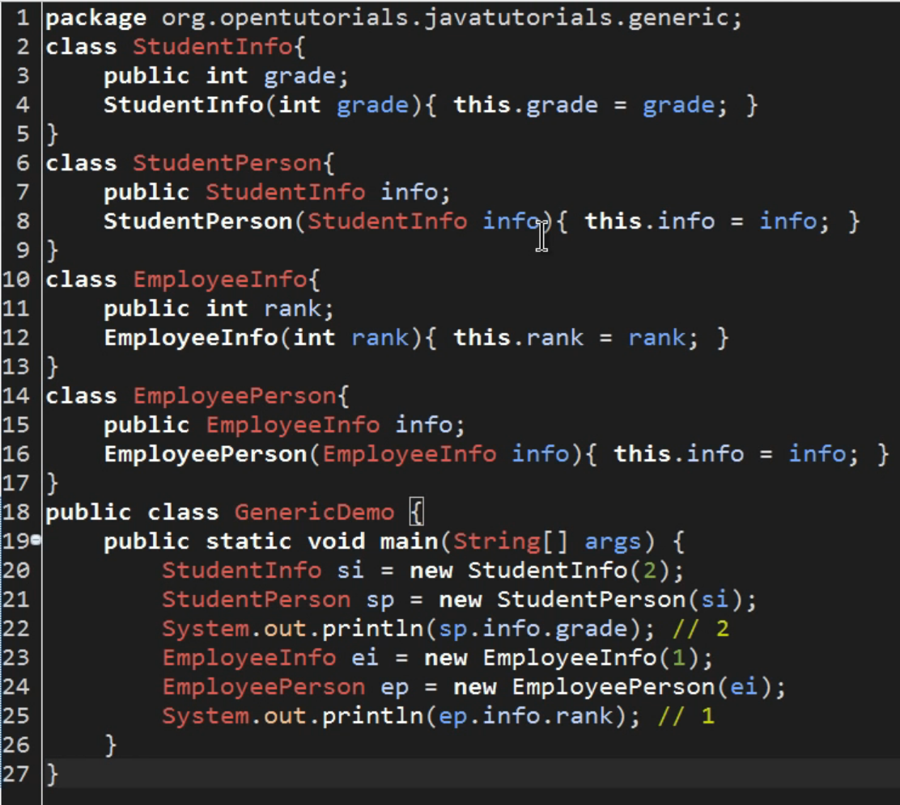
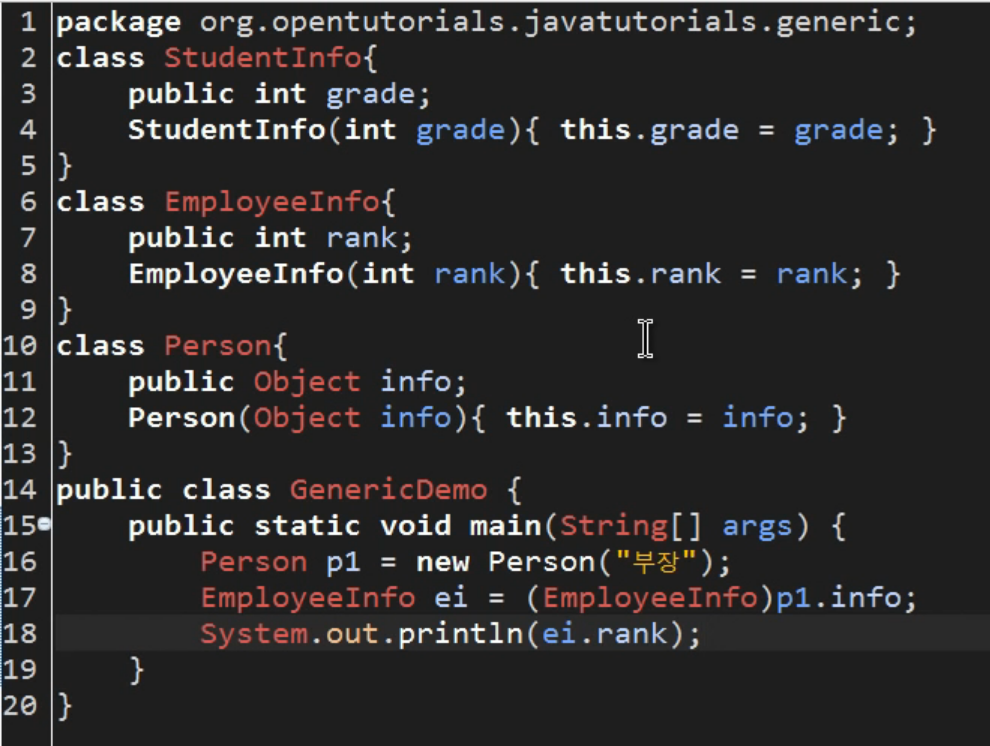
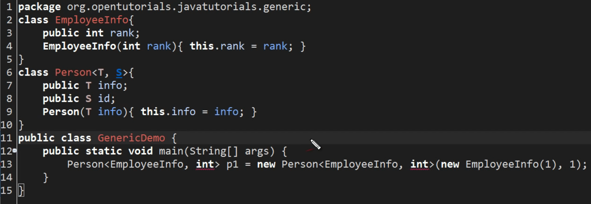

## Ch5. Generic
---
<br>

### <u>Generic?</u>
- 포괄적인, 일반적인 이라는 사전적 의미
- Generic은 클래스 내부에서 사용할 데이터 타입을 나중에, instance를 생성할 때 확정하는 것/기법 을 의미함

    <br>
    
**Generic 설명도**



<br>

### <u>왜 Generic을 사용하는가?</u>
- 자바 역사상 가장 늦게 도입된 새로운 기능중 하나 -> 그만큼 중요한 기능
- **`<참고>` 자바는 처음 개발될 때 타입 안전성을 위해 Generic을 고려 했으나 개발 복잡도가 너무 상승한다고 하여 보류하였다가 어느정도 시간이 흐른 뒤 개발/개선작업을 통해 해당 기능을 추가함**

    <br>

- Generic이 없을때의 예시



- Generic이 없을때의 문제점


- 이런경우 컴파일 단계에서 문제점이 발생하지 않고 실행시에 runtime 할 때 에러가 발생
- 이를 타입이 안전한지 않다, 타입안전성(type safety)이 떨어진다 등으로 표현함
- 자바의 경우 컴파일을 미리 함으로 써, 사용자가 개발단계에서 미리 에러/문제점 등을 발견할 수 있게 해준다는 장점을 가지고 있는데 위와 같은 경우는 그런 장점을 훼손시키는 경우임. (컴파일 단계에서 에러가 검출되도록 코드 작성을 하는것이 바람직함)
- 코드 중복을 제거함으로써 보다 나은 코드를 작성했다고 생각했지만, 결과적으로는 타입을 int로 정의해둔 것에서 Object 타입으로 변경함으로 인해 위와같은 문제를 야기함
- 데이터 타입을 미리 선언/정의 해두는 것의 장점 -> 정의된 타입 이외의 데이터는 들어올 수 없다! 멈춰! 타입이 안전해진다!
- 다른 데이터 타입이 들어온다? 타입이 안전하지 않다? -> 자바스럽지 못하다. 자바의 정서와는 맞지 않다.

    <br>

> **위와 같은 문제들을 해결하기 위해 도입된 기능이 Generic**
- 타입의 안전성을 지키며 코드의 중복을 없애는 편의성 등, 2마리 토끼를 모두 잡기 위함

<br>

### <u>그럼 어떻게 Generic을 사용하나? 복수의 제네릭?</u>
* Generic을 사용한 예시

- (복수의) 제네릭, T와 S에 올 수 있는 데이터 타입은 참조/Reference 타입만 가능함 => 기본 데이터 타입은 올 수 없음!
- 기본 데이터 타입: int, char, double 등등 -> 이미지에서 int 부분에 밑줄이 쳐진 이유!
- 기본 데이터 타입을 Generic으로 사용하기 위해선 wrapper class를 사용해야 함
- ex) int에 해당하는 wrapper class는 Integer, double은 Double 등

    <br>

## item 26. 로 타입은 사용하지 말라
---
<br>

### <u>용어정리</u>
- 클래스와 인터페이스 선언에 대해 *타입 매개변수*가 쓰이면 이를 *제네릭 클래스* 혹은 *제네릭 인터페이스*라고 하며
- 이 둘을 통틀어 *제네릭 타입* 이라고 한다
- 예로, 타입 매개변수 E를 받는 List 인터페이스, `List<E>`가 있다
- `List<E>`의 로 타입은 `List`이다.
- 로 타입(raw type)은 제네릭 타입에서 타입 매개변수를 전혀 사용하지 않은 것을 말함
- 로 타입의 용도: 제네릭이 나오기 전 코드와 호환되도록 하기 위해 제공됨

    <br>

### <u>로 타입을 사용하면?</u>
- Java 1.5 이전에는 콜렉션을 아래와 같이 사용하였음

```java
private final Collection stamps = ...;
stamps.add(new Coin(...));
// unchecked call "경고"를 호출하지만 컴파일도 되고 실행도 됨
```

- 위의 코드는 컴파일 오류를 발생시키지 않지만 실행시 Runtime Exception이 발생할 수 있음
- 예를 들어, add한 Coin 객체를 꺼내서 Stamp 변수에 할당할 때 ClassCastException이 발생함

    <br>

### <u>제네릭을 활용하면?</u>

```java
private final Collection<Stamp> stamps = ...;
stamps.add(new Coin()); // 컴파일 오류 발생
```

- 위와 같이 제네릭을 사용하면 바로 컴파일러는 stamps에 Stamp의 인스턴스만 넣어야 함을 인지하고
- stamp에 잘못된 타입의 인스턴스를 넣으려 하면 컴파일 오류가 발생하며 무엇이 잘못됐는지 알려줌
- 오류는 가능한 발생 즉시, 이상적으로는 컴파일할 때 발견하는 것이 좋음
- 현업에서도 BigDecimal용 컬렉션에 BigInteger를 넣는 등의 실수가 일어난다고 함
- **로 타입을 쓰면 제네릭이 안겨주는 안전성과 표현력을 모두 잃게 되므로, 절대 사용하면 안됨**
- 로 타입은 제네릭 이전에 작성된 코드와의 호환성 때문에 남겨진 것일 뿐 바람직하진 않음

    <br>
    
### <u>타입 안전성을 보장하지 않는 로 타입</u>

- `List`와 같은 로 타입은 권장하지 않지만 `List<Object>`는 괜찮다고 함
- 모든 타입을 허용한다는 의사를 컴파일러에게 명확하게 전달한 것이기 때문
- List와 `List<Object>`의 차이는? List는 제네릭 타입과 무관한 것이고, `List<Object>`는 모든 타입을 허용한다는 것
- 다시 말해 매개변수로 List를 받는 메서드에 `List<String>`을 넘길 수 있지만, 제네릭의 하위 규칙 때문에 `List<Object>`를 받는 메서드에는 매개변수로 넘길 수 없음
- `List<String>`은 로 타입인 `List`의 하위 타입이지만 `List<Object>`의 하위 타입은 아니고,
- **그 결과 `List<Object>`와 같은 매개변수화 타입을 사용할 때와 달리 `List`같은 로 타입을 사용하면 타입 안전성을 잃게 됨**

    <br>

### <u>예시 1. 매개변수화 타입</u>

```java
// unsafeAdd 메서드가 로 타입(List)을 사용하여 런타임에서 에러 발생
public static void main(String[] args) {
    List<String> strings = new ArrayList<>();
        unsafeAdd(strings, Integer.valueOf(42));
        String s = strings.get(0); // 컴파일러가 자동으로 형변환 코드를 넣어준다.
        }
        
        private static void unsafeAdd(List list, Object o) {
            list.add(o);
        }
```

- 위 코드는 컴파일은 되지만, unchecked 경고가 발생하며 이대로 실행하면 strings.get(0)의 결과를 형변환하려 할 때 ClassCastException 에러가 발생함

- 위 코드를 `List<Object>`로 수정하면
        
    ```java
    // 로 타입(List)을 매개변수화 타입인 List<Object>로 수정함
    public static void main(String[] args) {
        List<String> strings = new ArrayList<>();

        unsafeAdd(strings, Integer.valueOf(42));
        String s = strings.get(0);
    }

    // List<Object>
    private static void unsafeAdd(List<Object> list, Object o) {
        list.add(o);
    }
    ```

- 컴파일 에러가 발생하며 `incompatible types: List<String> cannot be converted to List<Object>`... 라는 에러 메세지 출력

    <br>

### <u>예시 2. 비한정적 와일드카드 타입 <?> </u>

- 아래의 코드는 2개의 집합(Set)을 받아 공통 원소를 반환하는 메소드이다

    ```java
    // 로 타입은 모르는 타입의 원소도 받아버림
    static int numElementsInCommon(Set s1, Set s2){
        int result = 0;
        for(Object o1 : s1){
            if(s2.contains(o1)){
                result++;
            }
        }
        return result;
    }
    ```

- 이 메소드는 동작은 하지만 타입 안전하진 않음
- 이때 비한정적 와일드카드 타입(unbounded wildcard type)을 대신 사용하는 게 좋다고 함
- **제네릭 타입을 쓰고 싶지만 실제 타입 매개변수가 무엇인지 신경 쓰고 싶지 않을 때는 물음표(?)를 사용**
    
    ```java
    // 비한정적 와이드카드 타입 사용 예시
    static int numElementsInCommon(Set<?> s1, Set<?> s2) {...}
    ``` 

- Set<?> = 안전, Set = 안전하지 않음
- 로 타입 컬렉션에는 아무 원소나 넣을 수 있으니 타입 불변식을 훼손하기 쉬움
- 반면, **Collection<?>에는 null 외에는 어떤 원소도 넣을 수 없고** 다른 원소를 넣으려 하면 컴파일할 때 오류가 발생함

    <br>


### <u>예외: 로 타입이 허용되는 경우</u>

1. **class 리터럴에는 로 타입을 써야 한다**
    - List.class, String[].class, int.class는 허용되지만, List<String>.class, List<?>, class는 허용하지 않는다.
    
    <br>
 
2. **instanceof 연산자는 비한정적 와일드카드 타입 이외의 매개변수화 타입에는 적용할 수 없다**
    
    - 런타임에는 제네릭 타입이 지워지기 때문이고
    
    - 로 타입이든 비한정적 와일드카드 타입이든 instanceof는 완전히 똑같이 동작함

    ```java
    // o의 타입이 Set인지 확인한 다음, 와일드카드 타입인 Set<?>으로 형변환해야 함
    if( o instanceof Set) {       // 로 타입
        Set<?> s = (Set<?>) o;    // 와일드카드 타입
    }
    ```


    <br>

## item 27. 비검사 경고를 제거하라
---

- 제네릭 사용시 많은 컴파일러 경고를 보게 된다고 함
- ex) 비검사 형변환 경고, 비검사 메서드 호출 경고, 비검사 매개변수화 가변인수 타입 경고, 비검사 변환 경고 등
- 이때 대부분의 비검사 경고는 쉽게 제거할 수 있고,
- 모든 비검사 경고는 런타임에 ClassCassException을 일으킬 수 있는 잠재적 가능성이 있으니 최선을 다해 제거해야 함
- 만약 제거 시킬 방법이 없다면 @SuppressWarning("unchecked") 를 통해 경고를 숨기는게 좋음
- 이렇게 숨겼을 시, 경고를 무시해도 되는 이유를 주석을 남겨줘야 함

    <br>

## item 28. 배열보다는 리스트를 사용하라
---

### <u>배열과 제네릭의 차이점</u>
1. **배열은 공변(covariant), 함께 변한다. 하지만 제네릭은 불공변(invariant), 함께 변하지 않는다.**

    - 배열: Sub가 Super의 하위타입이면, Sub[]는 Super[]의 하위타입임

    - 제네릭: `List<Sub>`는 `List<Super>` 의 하위타입도, 상위타입도 아님

    <br>

- 둘의 차이는 에러 발생 시점에 있음

- **배열**은 런타임 시점에 에러 발생, **리스트**는 컴파일 시점에 에러 발생  (컴파일 시점에 알 수 있는것이 더 좋음)    
    ```java
    // 런타임 시점에 에러 발생
    Object[] objectArray = new Long[1];
    objectArray[0] = "타입이 달라 넣을 수 없다.";  // ArrayStoreException

    // 컴파일 시점에 에러 발생
    List<Object> ol = new ArrayList<Long>();   // 호환되지 않는 타입
    ol.add("타입이 달라 넣을 수 없다.");  
    ```

    <br>

2. **배열은 실체화(reify) 된다**

    - 배열은 런타임 시점에도 자신이 담기로 한 원소의 타입인지를 확인함

        - Long 배열에 String을 넣으려니 ArrayStroeException이 발생함   

        <br>

    - 반면 제네릭은 타입 정보가 런타임 시점에는 **소거(erasure)**됨

        - 이를 통해 런타임 시점에 ClassCastException을 만나지 않고, 컴파일 시점에 오류를 잡아낼 수 있음
        
        <br>

    - 이러한 차이로 배열과 제네릭은 잘 어우러지지 못함
        ```java
        // 아래와 같은식으로 작성하면 컴파일할 때 제네릭 배열 생성 오류를 일으킴
        - new List<E>[] // 제네릭 타입
        - new List<String>[] // 매개변수화 타입
        - new E[] // 타입 매개변수
        ``` 

    <br>

- **타입 안정성을 위해 제네릭 배열 생성을 못하게 함**

- 아래 코드는 타입안정성이 확보된 리스트 기반의 코드
    ```java
    //리스트 기반 Chooser - 타입 안전성 확보
    public class Chooser<T> {
        
        private final List<T> choiceList;
        
        public Chooser(Collection<T> choices) {
            choiceList = new ArrayList<>(choices);
        }
        
        puvlic T choose() {
            Random rnd = ThreadLocalRandom.current();
            return choiceList.get(rnd.nextInt(choiceList.size()));
        }
    }
    ```