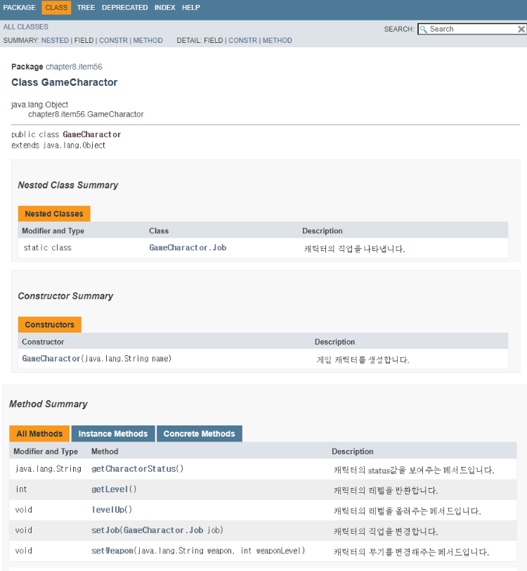

## Ch8. 메서드
---
<br>

## item 53. 가변인수는 신중히 사용하라
        Use varargs judiciously

---

- 가변인수 메서드를 호출하면 인수의 개수와 길이가 같은 배열을 만들고 인수들을 만들어진 배열에 저장한 후에 가변인수 메서드에 전달해줌
- 가변인수 메서드는 명시한 타입의 인수를 0개 이상 받을 수 있음
```java
static int sum(int ... args) {
    int sum = 0;
    for (int arg: args){
        sum += args;
    }
    return sum;
}
```

- 인수를 0개도 받을 수 있게 설계하는건 좋지 않음
```java
static int min(int ... args) {
    if (args.length ==0){
        throw new illegalArgumentException('인수가 1개 이상 필요합니다.');
    }
    int min = args[0];
    for (int i = 1; i < args.length; i++){   //잘못구현한 예
        if(args[i] < min>):
            min = args[i];
    }
}
```

- 인수가 1개 이상이어야 할 때는 아래와 같이 가변인수(remainingArgs) 앞에 필수 매개변수(firstArg)를 받도록 함
- 위 코드보다 깔끔한 코드가 됨

```java
static int min(int firstArg, int... remainingArgs) {
    int min = firstArg;
    for (int arg : remainingArgs) {
        if (arg < min) {
            min = arg;
        }
    }
    return min;
}
```

**성능에 민감한 상황이라면 가변인수가 걸림돌이가 될 수 있음**

- 가변인수는 성능에 해가 될 수 있기 때문에 사용할 때는 신중해야 함 
- 가변인수 메서드가 호출될 때마다 **배열을 새로 할당하고 초기화하기 때문**
<br>
- 따라서 아래와 같은 패턴으로 변경할 수도 있음

**성능 최적화의 이점은 없지만 가변인수의 유연성이 필요할 때 선택할 수 있는 패턴**

```java
public void foo() {}
public void foo(int arg1) {}
public void foo(int arg1, arg2) {}
public void foo(int arg1, arg2, arg3) {}
public void foo(int arg1, arg2, arg3, int... restArg) {} // 단 5%로만 사용
```

- 메서드 호출의 95%가 3개 이하의 인수를 사용한다고 가정
- 그렇기 때문에 가변인수는 5%의 호출을 담당

<br>

### 정리
**가변인수는 성능에 문제가 있을 수 있으니 신중히 사용하자**

**인수 개수가 일정하지 않은 메서드를 정의해야 한다면 가변인수가 반드시 필요**

**메서드를 정의할 때 필수 매개변수는 가변인수 앞에 두고, 가변인수를 사용할 때는 성능 문제까지 고려해야 함**

<br>

## item 54. null 이 아닌, 빈 컬렉션이나 배열을 반환하라
        Return empty collections or arrays, not nulls
---

- 아래와 같이 컬렉션이 빈 경우 null을 반환하는 메서드를 자주 볼 수 있는데,

```java
// 서버에서 null 반환 시
private final List<Cheese> cheesesInStock = ...;
public List<Cheese> getCheeses() {
    return cheesesInStock.isEmpty() ? null : new ArrayList<>(cheesesInStock);   // nono
}

// 클라에서는 방어 로직을 구현해야 함
List<Cheese> cheeses = show.getCheeses();
if (cheeses != null && cheeses.contains(Cheeses.STILTON)
    System.out.println('이렇게 예외 조건을 걸어줘야 함'))

```
- 컬렉션이나 배열 등이 비었을 때 null 을 반환하는 메서드를 사용할때면 위와 같이 방어 코드를 추가해줘야 함
- 때론, 빈 컨테이너를 할당할때에도 비용이 들어 null을 반환하는 쪽이 낫다는 주장이 있지만 두가지 면에서 틀린 주장임
    1. 성능 분석 결과 성능 저하의 주범이라고 확인되지 않는 한 이정도의 성능 차이는 신경쓸 수준이 못됨
    2. 빈 컬렉션과 배열은 굳이 새로 할당하지 않고도 반환할 수 있음
    ```java
    public List<Cheese> getCheeses(){
        return new ArrayList<>(cheesesInStock); // 빈 컬렉션을 반환하는 방법
    }
    ```

- 그럼에도 눈에 띄는 성능 저하가 발생한다면, 매번 같은 빈 '불변' 컬렉션을 반환하면 됨

```java
// 매번 새로운 빈 컬렉션 대신 같은 빈 불변 컬렉션 반환
public List<Cheese> getCheeses() {
    return cheesesInStock.isEmpty() ? Collections.emptyList() : new ArrayList<>(cheesesInStock);
}
```

- 배열의 경우에도 마찬가지로,
- null 반환 대신에 길이가 0인 배열을 반환하면 됨
    - 컬렉션과 동일하게 빈 배열을 매번 새롭게 할당하지 않고 반환하는 방법도 있음

```java
// 길이가 0인 배열 반환
public Cheese[] getCheeses() {
    return cheesesInStock.toArray(new Cheese[0]);
}

// 매번 새로 할당하지 않게 하는 방법
private static final Cheese[] EMPTY_CHEESE_ARRAY = new Cheese[0];

public Cheese[] getCheeses() {
    return cheesesInStock.toArray(EMPTY_CHEESE_ARRAY);
    // 아래와 같이 미리 할당하는 것은 오히려 성능을 떨어뜨릴 수 있음
    // return cheesesInStock.toArray(new Cheese[cheesesInStock.size()]);
}
```
- 단순 성능 개선이 목적이라면 toArray에 넘기는 배열을 미리 할당하는건 추천하지 않는다고 함
    - toArray는 원소가 하나라도 있다면 배열을 새로 생성하고 0개이면 전달받은 배열은 반환함

### 정리
**null이 아닌, 빈 배열이나 컬렉션을 반환하라**

<br>

## item 55. 옵셔널 반환은 신중히 하라
        Return optionals judiciously
---

- 메서드가 특정 조건에서 값을 반환할 수 없을 때가 있는데, 자바 8 전에는 예외를 던지거나 null을 반환했음
- 하지만 예외는 진짜 예외적인 경우에만 사용해야 하며, 예외 생성 시 스택 추적 전체를 캡처하므로 비용도 큼
- 또한, null이 반환 되지 않는다고 확신하지 않는 한 NullPointerException과 같은 별도의 null 처리 코드를 만들어야 함

<br>

- 그러나 자바 8 이후로는 Optional<T> 라는 대안이 등장하였고,
    - null 이 아닌 T 타입 참조를 하나 담거나 또는 아무것도 담지 않을 수 있음
    - 아무것도 담지 않은 Optional은 '비었다'고 말하고, 어떤 값을 담은것은 '비지 않았다'고 함
    - 원소를 최대 1개 가질 수 있는 ‘불변’ 컬렉션이며, 보다 null-safe한 코드를 작성할 수 있게 됨
    - 옵셔널을 반환하는 메서드는 예외를 던지는 메서드보다 유연하고 사용하기 쉬우며, null을 반환하는 메서드보다 오류 가능성이 적음

```java
// 컬렉션에서 최대값을 구하고, 컬렉션이 비어 있으면 예외 반환 (옵셔널을 사용하지 않았을 때)
public static <E extends Comparable<E>> E max(Collection<E> c) {
    if (c.isEmpty()) {
        throw new IllegalArgumentException("빈 컬렉션");
    }        

    E result = null;
    for (E e : c) {
        if (result == null || e.compareTo(result) > 0)
            result = Objects.requireNonNull(e);
    }
    return result;
}

// 컬렉션에서 최댓값을 구해 옵셔널로 반환 (옵셔널 사용)
public static <E extends Comparable<E>>
Optional<E> max(Collection<E> c) {
    if (c.isEmpty())
        return Optional.empty();
 
    E result = null;
    for (E e : c)
        if (result == null || e.compareTo(result) > 0)
            result = Objects.requireNonNull(e);
 
    return Optional.of(result);
}
```
- 위와 같이, 빈 컬렉션이 들어왔을 때 IllegalArgumentException이 반환되는 것 보다 Optional<E> 를 반환하는 것이 더 낫다고 함
<br>
- Optional.empty(): 빈 Optional을 만드는 메서드
- Optional.of(value): 값이 든 Optional을 만드는 메서드

**주의: Optional을 반환하는 메서드에서는 절대 null을 반환하지 말자**

<br>

### 옵셔널의 장점
- 옵셔널은 검사 예외와 취지가 비슷
- 즉, 반환 값이 없을 수도 있음을 API 사용자에게 명확히 알려주고,
- 이렇게 검사 예외를 던진다면 클라이언트는 반드시 이에 대해 대처하는 코드를 작성해야 함

<br>

### 옵셔널 활용 및 주의사항

<br>

#### **활용1. 기본값을 설정**
- 옵셔널을 반환하는 메서드로부터 원하는 값을 받지 못했을 때, 기본 값을 설정할 수 있음

```java
String lastWordInLexicon = max(words).orElse("단어 없음...");
```

#### **활용2. 원하는 예외값을 반환 할 수 있음**

```java
Toy myToy = max(toys).orElseThrow(TemperTantrumException::new);
```

#### **활용2. 항상 값이 채워짐을 가정 (NoSuchElementException을 주의)**
- 옵셔널에 항상 값이 있음을 확신할 때 사용해야 함
- 값이 없다면 NoSuchElementException이 발생

```java
Element lastNobleGas = max(Elements.NOBLE_GASES).get();
```

#### **활용3. 기본값 설정 비용이 큰 경우**
- 기본값 설정 비용이 커서 부담이라면 orElseGet을 사용
- 값이 처음 필요할 때 Supplier<T>를 사용하여 생성하므로 초기 설정 비용을 낮출 수 있음

```java
Connection conn = getConnection(dataSource).orElseGet(() -> getLocalConn());
```

<br>

**주의점**
- 컬렉션, 스트림, 배열, 옵셔널 같은 컨테이너를 옵셔널로 감싸면 안됨
- Optional<List<T>>를 반환하는 것보다 그저 빈 리스트 List<T>를 반환하는 것이 바람직하며,
- 빈 컨테이너를 그대로 반환하면 클라이언트에서는 옵셔널 처리 코드를 만들지 않아도 되기 때문

<br>

**옵셔널을 맵의 값으로 사용하면 절대 안됨**

- Map에 사용하는 것을 예로, 맵 안에 키가 없다는 정의가 2가지가 되는데,
- “키 자체가 없는 경우”와 “키는 있지만 속이 빈 옵셔널인 경우”, 이 2가지로 모호해짐
- 또한 옵셔널을 컬렉션의 키, 값, 원소 그리고 배열의 원소로 사용하는 것은 좋지 않음

<br>

### 정리
- **값을 반환하지 못할 가능성이 있고, 호출할 때마다 반환 값이 없을 가능성을 염두에 둬야 하는 메서드라면 옵셔널을 반환**하도록 하자
- 하지만 옵셔널 반환에는 성능 저하가 뒤따르니, **성능에 민감한 메서드라면 null을 반환하거나 예외를 던지는 편이 나을 수 있다**
- **옵셔널을 반환값 이외의 용도로 쓰는 경우는 매우 드물다**

<br>

## item 56. 공개된 API 요소에는 항상 문서화 주석을 작성하라
    Write doc comments for all exposed API elements

---

- **API를 쓸모 있게 하려면 잘 작성된 문서도 함께 제공해야 함**

<br>

### 자바독, Javadoc  이란?
- API 문서화 유틸리티
- 소스코드 파일에서 **문서화 주석**이라는 특수한 형태로 기술된 설명을 추려 API 문서로 변환해줌

### API를 올바르게 문서화하는 방법

- 작성된 API를 올바르게 문서화하려면 공개된 모든 클래스, 인터페이스, 메서드 필드 선언에 문서화 주석을 달아야 한다
- 문서가 잘 갖춰지지 않은 API는 쓰기 헷갈려서 오류의 원인이 되기 쉬움 -> 문서화 필요!
- 공개 클래스는 기본 생성자에 주석을 달 수 있는 방법이 없으므로, 절대 기본 생성자를 사용해선 안됨
- 문서화 주석이 없다면 자바독도 단순히 공개 API 요소들의 '선언'만 나열해주는게 전부


### **메서드용 문서화 주석에는 메서드와 클라이언트 사이의 규약을 명료하게 기술하자**
- 상속용으로 설계 된 클래스의 메서드가 아니라면 무엇을 하는지를 기술해야 함. 즉, **how(어떻게 동작하는지)가 아닌 what을 기술**
- 클라이언트가 해당 메서드를 호출하기 위한 전제조건을 모두 나열해야 하고
- 메서드가 성공적으로 수행된 후 만족해야 하는 사후조건을 모두 나열해야 함

- 일반적으로 전제조건은 @throws 태그로 비검사 예외를 선언
    - 비검사 예외 하나가 전제조건 하나와 연결

- @param 태그를 이용해 해당 조건에 영향 받는 매개변수에 기술할 수도 있음
- 전제조건과 사후조건 뿐만 아니라 부작용도 문서화해야 함
    - 부작용은 사후 조건으로 명확히 나타나지는 않지만 시스템의 상태에 어떠한 변화를 가져오는 것을 의미함

<br>

#### 자바독 예시
        

        
<br>

### 태그 작성 가이드

<table>
  <thead>
    <tr>
      <th style="text-align: left">태그</th>
      <th style="text-align: left">용도</th>
      <th style="text-align: left">가이드</th>
    </tr>
  </thead>
  <tbody>
    <tr>
      <td style="text-align: left">@param</td>
      <td style="text-align: left">모든 매개변수</td>
      <td style="text-align: left">관례상 명사구를 사용하며 마침표 없이 작성한다.</td>
    </tr>
    <tr>
      <td style="text-align: left">@return</td>
      <td style="text-align: left">void가 아닌 반환</td>
      <td style="text-align: left">관례상 명사구를 사용하며 마침표 없이 작성한다. <br> 메서드 설명과 같을 때는 생략할 수 있다.</td>
    </tr>
    <tr>
      <td style="text-align: left">@throws</td>
      <td style="text-align: left">발생할 가능성 있는 모든 예외</td>
      <td style="text-align: left">관례상 마침표 없이 작성한다.</td>
    </tr>
    <tr>
      <td style="text-align: left">@code</td>
      <td style="text-align: left">코드용 폰트로 렌더링</td>
      <td style="text-align: left">HTML 요소나 다른 자바독 태그를 무시한다.</td>
    </tr>
    <tr>
      <td style="text-align: left">@implSpec</td>
      <td style="text-align: left">구현스펙 안내</td>
      <td style="text-align: left">해당 메서드와 하위 클래스 사이의 계약 설명</td>
    </tr>
    <tr>
      <td style="text-align: left">@literal</td>
      <td style="text-align: left">HTML 요소 무시</td>
      <td style="text-align: left">@code와 다르게 코드용 폰트로 렌더링하지 않는다.</td>
    </tr>
    <tr>
      <td style="text-align: left">@index</td>
      <td style="text-align: left">색인화</td>
      <td style="text-align: left">자바 9에서 추가되었으며 지정한 용어를 색인화할 수 있다.</td>
    </tr>
    <tr>
      <td style="text-align: left">@summary</td>
      <td style="text-align: left">요약 설명</td>
      <td style="text-align: left">해당 설명에 대한 요약(자바 10부터)</td>
    </tr>
  </tbody>
</table>

### API 문서화에서 자주 누락되는 설명
- 스레드 안정성
    - 클래스 혹은 정적 메서드가 스레드 안전하든 그렇지 않든, 스레드 안전 수준을 반드시 명시해야 함
- 직렬화 가능성
    - 직렬화할 수 있는 클래스라면 직렬화 형태도 API 설명에 기술해야 함
    
### 정리

- **문서화 주석은 API를 문서화하는 가장 효과적인 방법**이므로
- 공개 API라면 빠짐없이 설명을 달아야 하고
- 표준 규약을 일관되게 지켜야 하며
- 문서화 주석에 임의의 HTML 태그를 사용할 수 있음. 단, HTML 메타 문자는 특별하게 취급해야 한다
